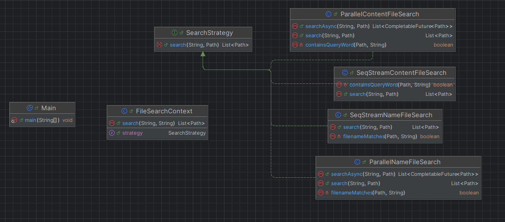

# 🔍 Java File Search Tool 

Java file search tool that allows users to search for files by **name** or by **content**, using either **sequential** or **parallel** processing. Built using the **Strategy Design Pattern**, this project demonstrates clean architecture and modern Java practices like Streams, parallelism, and input validation.

---
## 🧠 Search Strategies

| Option | Strategy Class                  | Description                              |
|--------|----------------------------------|------------------------------------------|
| 1      | `SeqStreamContentFileSearch`    | Sequential search inside file contents   |
| 2      | `ParallelContentFileSearch`     | Parallel content search using threads    |
| 3      | `SeqStreamNameFileSearch`       | Sequential file name matching            |
| 4      | `ParallelNameFileSearch`        | Parallel file name matching              |

---
## Class Diagram

